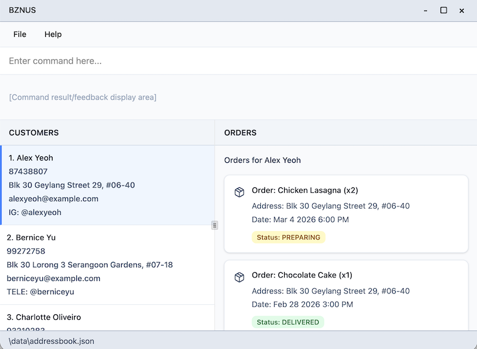
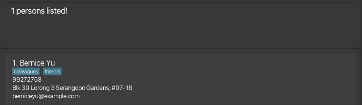

# BZNUS User Guide

BZNUS is a **desktop app for tracking customer contacts, food orders and customer-specific preferences.** It is **optimized for use via a Command Line Interface** (CLI) while still having the benefits of a Graphical User Interface (GUI). If you can type fast, BZNUS can get your contact management and order tracking tasks done faster than traditional GUI apps.

<!-- * Table of Contents -->
<page-nav-print />

--------------------------------------------------------------------------------------------------------------------

## Table of Contents
1. [Quick start](#quick-start)
2. [Features](#features)
* [Viewing help: help](#viewing-help--help)
3. [Customer command](#customer-commands)
* [Adding a customer: add](#adding-a-customer--add)
* [Listing all customers: list](#listing-all-customers--list)
* [Editing a customer: edit](#editing-a-customer--edit)
* [Finding customers: find](#finding-customers--find)
* [Deleting a customer: delete](#deleting-a-customer--delete)
4. [Order command](#order-commands)
* [Adding an order: order](#adding-an-order--order)
* [Finding orders: find-o](#finding-orders--find-o)
* [Listing all orders: list-o](#listing-all-orders--list-o)
* [Deleting an order: delete-o](#deleting-an-order--delete-o)
5. [Other command](#order-commands)
* [Clearing all entries: clear](#clearing-all-entries--clear)
* [Exiting the program: exit](#exiting-the-program--exit)
6. [Data storage](#data-storage)
* [Saving the data](#saving-the-data)
* [Editing the data file](#editing-the-data-file)
* [Archiving the data [coming in v2.0]](#archiving-data-files-coming-in-v20)
7. [FAQ](#faq)
8. [Known issues](#known-issues)
9. [Command summary](#command-summary)
* [Customer Commands](#customer-commands-1)
* [Order Commands](#order-commands-1)
* [Other Commands](#other-commands-1)

--------------------------------------------------------------------------------------------------------------------

## Quick start

1. Ensure you have Java `17` or above installed in your Computer. 
   **Mac users:** Ensure you have the precise JDK version prescribed [here](https://se-education.org/guides/tutorials/javaInstallationMac.html).

2. Download the latest `.jar` file from [here](https://github.com/AY2526S2-CS2103T-W09-3/tp/releases).

3. Copy the `.jar` file to the folder you want to use as the _home folder_ for BZNUS.

4. Open a command terminal, `cd` into the folder you put the jar file in, and use the `java -jar bznus.jar` command to run the application. 
   A GUI similar to the following should appear in a few seconds. Note how the app contains some sample data. \
   

5. Type the command in the command box and press Enter to execute it. e.g. typing **`help`** and pressing Enter will open the help window. 
   Some example commands you can try:

   * `list` : Lists all customers.

   * `add n/John Doe p/98765432 a/John street, block 123, #01-01` : Adds a contact named `John Doe` to the customer database.

   * `order 1  i/Pizza  q/3  at/2026-04-02 1200 a/123 Jurong West St 42, #05-01 s/PREPARING` : Adds an order for 3 pizzas to the 1st customer in the current list.

   * `delete 3` : Deletes the 3rd contact shown in the current list.

   * `clear` : Deletes all contacts.

   * `exit` : Exits the app.

6. Refer to the [Features](#features) below for details of each command.

--------------------------------------------------------------------------------------------------------------------

## Features

<box type="info" seamless>

**Notes about the command format:** 

* Words in `UPPER_CASE` are the parameters to be supplied by the user. 
  e.g. in `add n/NAME`, `NAME` is a parameter which can be used as `add n/John Doe`.

* Items in square brackets are optional. 
  e.g `n/NAME [t/TAG]` can be used as `n/John Doe t/friend` or as `n/John Doe`.

* Items with `…`​ after them can be used multiple times including zero times. 
  e.g. `[t/TAG]…​` can be used as ` ` (i.e. 0 times), `t/friend`, `t/friend t/family` etc.

* Parameters can be in any order. 
  e.g. if the command specifies `n/NAME p/PHONE_NUMBER`, `p/PHONE_NUMBER n/NAME` is also acceptable.

* Extraneous parameters for commands that do not take in parameters (such as `help`, `list`, `exit` and `clear`) will be ignored. 
  e.g. if the command specifies `help 123`, it will be interpreted as `help`.

* If you are using a PDF version of this document, be careful when copying and pasting commands that span multiple lines. Space characters surrounding line-breaks may be omitted when copied over to the application.
  * **Solution:** Type the command manually if pasting doesn't work.

</box>

### Viewing help : `help`

Shows a message explaining how to access the help page.

Format: `help`

--------------------------------------------------------------------------------------------------------------------

## Customer Commands

### Adding a customer : `add`

Adds a customer to the customer database.

Format: `add n/NAME [p/PHONE_NUMBER] [ig/INSTAGRAM] [fb/FACEBOOK] [a/ADDRESS] [r/REMARK] [t/TAG]…​`

* `NAME` is mandatory. It should only contain alphanumeric characters, spaces, and apostrophes (e.g., Mary O'Connor). It cannot be blank.
* `PHONE` must be a numeric string between 8 and 15 digits long (e.g., 91234567 or 60123456789).
* `INSTAGRAM` should be 1–30 characters long and contain only letters, numbers, underscores, and periods. It should not end with a period or have consecutive periods. No internal whitespaces allowed. The `@` prefix is optional.
* `FACEBOOK` should be 5-50 characters long and contain only letters, numbers, and periods. It should not have leading, trailing, or consecutive periods. No internal whitespaces allowed. The `@` prefix is optional.
* `ADDRESS` can be any non-blank string.
* `REMARK` can be any string.

<box type="warning" seamless>

**Note:** A customer must have at least one contact method (`PHONE`, `INSTAGRAM`, `FACEBOOK` or `ADDRESS`).

</box>

<box type="warning" seamless>

**Duplicate Handling:** Customer names are unique (case-insensitive). For example, "John Doe" and "john doe" are considered the same person, and the app will reject the duplicate entry. (Tip: Consider adding descriptors to differentiate customers with the same name (e.g., "John Doe (neighbour)" and "John Doe (Clementi)".)

</box>

<box type="tip" seamless>

**Tip:** A customer can have any number of tags (including 0).

</box>

Examples:
* `add n/John Doe p/98765432 ig/john a/John Street, Blk 123, #01-01 r/prefers weekend delivery t/VIP t/regular`
* `add n/Betsy Crowe t/friend fb/betsy.crowe a/Blk 456, Bedok North r/allergic to peanuts`
* `add n/Tech Corp SG p/67778888 ig/techcorp.sg a/Tech Tower, Level 12 r/Invoicing required`

### Listing all customers : `list`

Shows a list of all customers in the address book.

Format: `list`

### Editing a customer : `edit`

Edits an existing customer in the address book.

Format: `edit INDEX [n/NAME] [p/PHONE] [ig/INSTAGRAM] [fb/FACEBOOK] [a/ADDRESS] [r/REMARK] [t/TAG]…​`

* Edits the customer at the specified `INDEX`. The index refers to the index number shown in the displayed customer list. The index **must be a positive integer** 1, 2, 3, …​
* At least one of the optional fields must be provided.
* Existing values will be updated to the input values.
* When editing tags, the existing tags of the customer will be removed i.e adding of tags is not cumulative.
* You can remove all the customer’s tags by typing `t/` without
    specifying any tags after it.

Examples:
*  `edit 1 p/91234567 a/John Street, Blk 123, #02-02` Edits the phone number and delivery address of the 1st customer to be `91234567` and `John Street, Blk 123, #02-02` respectively.
*  `edit 2 n/Betsy Crower t/` Edits the name of the 2nd customer to be `Betsy Crower` and clears all existing tags.

### Finding customers : `find`

Finds customers whose details match the given keywords. You can search across all fields or target a specific field using prefixes.

#### General Search
Format: `find KEYWORD [MORE_KEYWORDS]`

* The search is case-insensitive. e.g `hans` will match `Hans`.
* All fields are searched.
* Partial matches are supported e.g. `Han` will match `Hans`.

Examples:
* `find John` returns `john` and `John Doe`
* `find 99272758` returns `Bernice Yu` if her contact details contains these digits \
  

#### Specific Field Search
Format: `find PREFIX/KEYWORD`

* The search is case-insensitive. e.g `hans` will match `Hans`.
* Limits the search to a single specified field.
* Allow to search with multiple prefixes.

Available Prefixes:
* `n/NAME`
* `p/PHONE`
* `fb/FACEBOOK`
* `ig/INSTAGRAM`
* `a/ADDRESS`
* `r/REMARK`
* `t/TAG`

Examples:
* `find n/Alice` returns all customers whose name contains `Alice`.
* `find t/regular` returns all customers whose tags contain `regular`.
* `find n/Bob r/non-spicy` returns all customers whose name contain `Bob` and with remark `non-spicy`.

### Deleting a customer : `delete`

Deletes the specified customer from the customer database.

Format: `delete INDEX`

* Deletes the customer at the specified `INDEX`.
* The index refers to the index number shown in the displayed customer list.
* The index **must be a positive integer** 1, 2, 3, …​
* All orders associated with the deleted customer will also be removed.

Examples:
* `list` followed by `delete 2` deletes the 2nd customer in the address book.
* `find Betsy` followed by `delete 1` deletes the 1st customer in the results of the `find` command.

---

## Order Commands

### Adding an order : `order`

Adds a new order for a specific customer.

Format: `order INDEX i/ITEM_NAME q/QUANTITY at/DELIVERY_TIME [a/DELIVERY_ADDRESS] [s/STATUS]`

* Adds an order to the customer at the specified `INDEX`.
* The index refers to the index number shown in the displayed customer list.
* The index **must be a positive integer** 1, 2, 3, …​
* `ITEM_NAME` should contain only alphanumeric characters and spaces, and cannot be blank.
* `QUANTITY` **must be a positive integer** 1, 2, 3, …​.
* `DELIVERY_TIME` must be in `yyyy-mm-dd hhmm` format and must be a future date/time.
* If `DELIVERY_ADDRESS` is not provided, the customer's stored address will be used.
* If `STATUS` is not provided, it defaults to `PREPARING`. Valid statuses: `PREPARING`, `READY`, `DELIVERED`, `CANCELLED`.

**Examples:**
* `order 1 i/Pizza q/3 at/2026-04-02 1200`
* `order 2 i/Burger q/5 at/2026-03-15 1800 a/123 Jurong West St 42, #05-01`
* `order 3 i/Salad q/2 at/2026-04-10 1200 s/DELIVERED`

### Finding orders : `find-o`

Search for different orders with 4 category options: item name, delivery address, customer id, status

Format: `find-o Category-Type/Category-Keywords`

* Find the orders given the `Category-Keywords` from the `Category-Type`.
* The category keywords refer to the keyword used to look for orders.
* The category type refers to one of the 4 category options shown above.
* The category type **must be one of i/a/c/s**, which are respectively item, address, customer, status.
* This command will only accept one keyword, do not input multiple keywords.

**Examples:**
* `find-o i/pizza` - Look for orders with item keyword "pizza"
* `find-o a/Ang Mo Kio` - Look for orders with delivery address "Ang Mo Kio"
* `find-o s/Delivered` - Look for orders that are already delivered

### Listing all orders : `list-o`

Shows a list of all orders in the address book.

Format: `list-o`

### Deleting an order : `delete-o`

Deletes the specific order from the order database.

Format: `delete-o ORDER_INDEX`

* Deletes the order at the specified `ORDER_INDEX`.
* The order index refers to the index number shown in the displayed order list.
* The index **must be positive integers** 1, 2, 3, …​

**Examples:**
* `list-o` followed by `delete-o 3` deletes the 3rd order in the results of the `list-o` command.
* `find-o i/pizza` followed by `delete-o 1` deletes the 1st order in the results of the `find-o` command.

---

## Other Commands

### Clearing all entries : `clear`

Clears all customers and their orders from BZNUS.

Format: `clear`

### Exiting the program : `exit`

Exits the program.

Format: `exit`

---
## Data Storage

### Saving the data

BZNUS data is saved in the hard disk automatically after any command that changes the data. There is no need to save manually.

### Editing the data file

BZNUS data is saved automatically as a JSON file `[JAR file location]/data/addressbook.json`. Advanced users are welcome to update data directly by editing that data file.

<box type="warning" seamless>

**Caution:**
If your changes to the data file makes its format invalid, BZNUS will discard all data and start with an empty data file at the next run.  Hence, it is recommended to take a backup of the file before editing it. 
Furthermore, certain edits can cause BZNUS to behave in unexpected ways (e.g., if a value entered is outside the acceptable range). Therefore, edit the data file only if you are confident that you can update it correctly.

</box>

### Archiving data files `[coming in v2.0]`

_Details coming soon ..._

--------------------------------------------------------------------------------------------------------------------

## FAQ

**Q**: How do I transfer my data to another computer? 
**A**:
1. Install BZNUS on the new computer, run it once, then close the app.
2. On your old computer, open the folder containing `bznus.jar`, then go to `data/addressbook.json`.
3. Copy `addressbook.json` to the same location on the new computer (`[JAR file location]/data/`) and replace the existing data file.
4. Start BZNUS again. Your customers and orders should appear.

--------------------------------------------------------------------------------------------------------------------

## Known issues

1. **When using multiple screens**, if you move the application to a secondary screen, and later switch to using only the primary screen, the GUI will open off-screen. The remedy is to delete the `preferences.json` file created by the application before running the application again.
2. **If you minimize the Help Window** and then run the `help` command (or use the `Help` menu, or the keyboard shortcut `F1`) again, the original Help Window will remain minimized, and no new Help Window will appear. The remedy is to manually restore the minimized Help Window.

--------------------------------------------------------------------------------------------------------------------

## Command summary

### Customer Commands

Action     | Format, Examples
-----------|----------------------------------------------------------------------------------------------------------------------------------------------------------------------
**Add**    | `add n/NAME [p/PHONE_NUMBER] [fb/FACEBOOK] [ig/INSTAGRAM] [a/ADDRESS] [r/REMARK] [t/TAG]…​`   e.g., `add n/James Ho p/99996666 fb/james.Ho ig/james_Ho a/123, Clementi Rd, 1234665 r/extra spicy, no onion t/friend t/regular`
**Edit**   | `edit INDEX [n/NAME] [p/PHONE_NUMBER] [fb/FACEBOOK] [ig/INSTAGRAM] [a/ADDRESS] [r/REMARK] [t/TAG]…​`   e.g., `edit 2 n/James Lee ig/jamesLee`
**Find**   | `find KEYWORD [MORE_KEYWORDS]`   e.g., `find James Jake`   Or `find PREFIX/KEYWORD`   e.g., `find fb/james` or `find ig/james_ho`
**List**   | `list`
**Delete** | `delete INDEX`   e.g., `delete 3`

### Order Commands

Action     | Format, Examples
-----------|----------------------------------------------------------------------------------------------------------------------------------------------------------------------
**Add**| `order INDEX i/ITEM_NAME q/QUANTITY at/DELIVERY_TIME [a/DELIVERY_ADDRESS] [s/STATUS]`   e.g., `order 3 i/Pizza q/3 at/2026-04-02 1200 a/123 Jurong West St 42, #05-01 s/PREPARING`
**Find** | `find-o Category-Type/Category-Keywords`   e.g., `find-o i/pizza`
**List** | `list-o`
**Delete** | `delete-o ORDER_INDEX`   e.g., `delete-o 1`

### Other Commands

Action     | Format, Examples
-----------|----------------------------------------------------------------------------------------------------------------------------------------------------------------------
**Help**   | `help`
**Clear**  | `clear`
**Exit**   | `exit`
